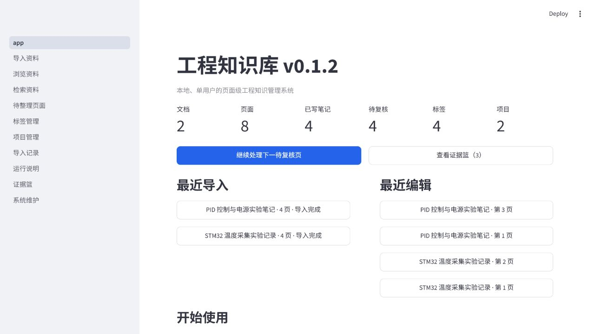
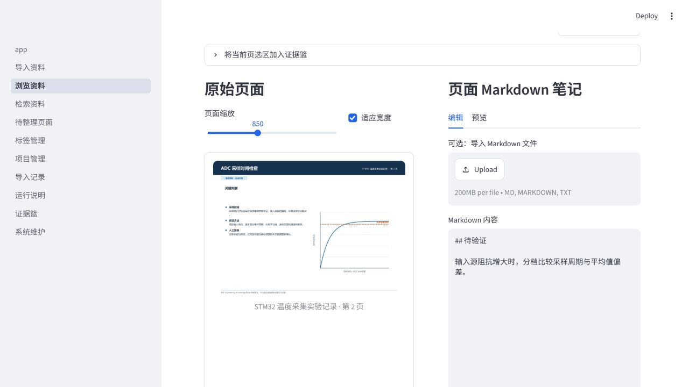
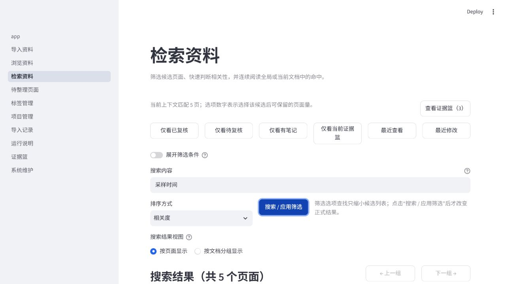
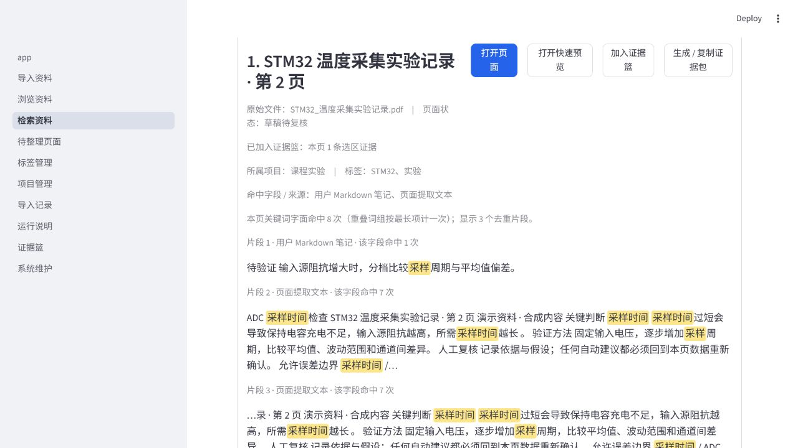
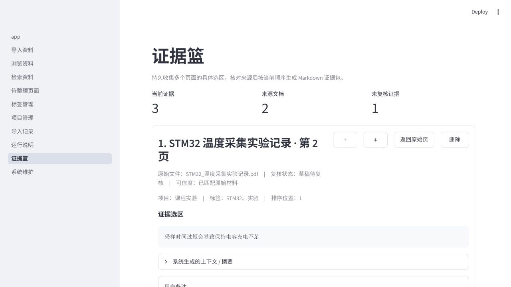
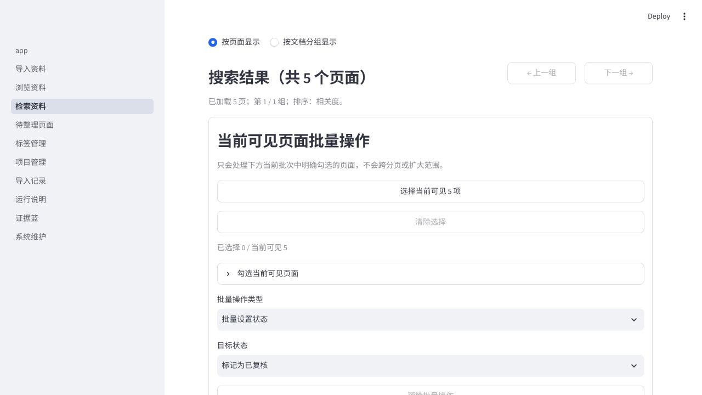

# Engineering Knowledge Base

## 面向工科学生的本地工程资料管理工具

将分散的 PDF、课程笔记和实验资料整理为可检索、可复核、可摘录、可长期积累的个人工程知识库。

> **公开范围说明**
>
> 公开项目展示仓库。当前公开项目介绍与界面演示，完整源码和可安装版本尚未公开。

| 项目状态 | 当前说明 |
| --- | --- |
| 当前阶段 | 已有本地可运行 MVP |
| 本次展示基线 | **v0.4.0** |
| 当前状态 | **v0.4.0 已正式发布**（Ruff、1020 项完整 pytest 和真人 Smoke Test 全部通过） |
| 当前仓库 | 仅用于项目公开展示 |
| 暂未公开 | 完整源码与可安装版本 |

> 公开发布摘要：[Engineering Knowledge Base v0.4.0](docs/v0.4.0-release-summary.md)

## 1. 为什么做这个项目

学习工程类课程时，真正困难的往往不是“看懂一次”，而是几周后仍能找到依据、复核判断并继续使用：

- PDF、课程笔记、实验记录和代码资料散落在不同位置；
- 经常记得看过某个知识点，却难以回到具体页面和原始来源；
- 阅读、复核、摘录、备注和后续整理分散在不同工具；
- 同一知识点会在课程、实验和项目中反复出现，工程知识需要长期积累和来源追溯，而不是一次性问答。

> “我需要的不是一次性总结，而是一套能把资料位置、页面依据和自己的理解长期留下来的工作流。”

项目的目标不是替代阅读，而是让理解、来源与后续复用连成一条线。

## 2. 核心工作流

```text
资料导入
  → 页面阅读与复核
  → 全文检索与定位
  → 摘录与备注
  → 批量整理
  → 本地备份与恢复
```

系统围绕“页面”保存状态、笔记、证据选区和来源位置，让检索结果能够回到具体文档与页码。

## 3. 当前已经实现

以下能力来自稳定展示基线 v0.4.0：

- **资料导入与页面化**：PDF 导入、SHA-256 去重、原文件保留、逐页渲染与已有文本层提取；
- **页面阅读与复核**：页面原图、页面级 Markdown 笔记和人工复核状态；
- **中文全文检索**：多关键词、组合筛选、排序、命中字段和关键词高亮；
- **证据篮与来源追溯**：保存具体选区、备注、页码和来源校验信息；
- **可见范围批量整理**：对当前可见页面批量处理状态、标签和项目，并在写入前预检与确认；
- **本地维护**：完整备份、恢复预检和只读诊断。

### v0.4.0 Evidence Objects & Source Model

- **三类证据对象**：整页、文字选区和图片区域统一进入证据篮；
- **来源追溯**：页面引用、来源文本哈希或原始 PNG 哈希 + 尺寸 + 坐标与证据类型匹配；
- **人工确认状态**：证据可由用户显式确认或取消确认，并记录确认时间；
- **笔记 → 证据篮**：页面、文字选区和图片区域结构化笔记可显式加入证据篮；
- **侧边栏重排**：按导入、阅读整理、知识组织和维护工作流重新组织页面；
- **schema v7**：既有证据完整保留并迁移为未确认的文字选区证据。

### v0.3.0 结构化笔记基础

- **四类结构化笔记**：文档级、页面级、文字选区和图片区域笔记；
- **统一列表**：集中浏览和筛选四类笔记；
- **来源状态检查**：识别文字选区或图片区域的来源变化；
- **来源重新定位**：文字选区可重新绑定，图片区域可重新框选；
- **显式删除**：四类笔记均由用户明确触发并确认删除；
- **文档删除一致性**：删除导入文档时一致处理关联笔记；
- **schema v5**：为结构化笔记提供本地 SQLite 数据基础。

用户笔记与来源对象保持分离。删除笔记不会删除原始 PDF 或原始页面。

### v0.2.x PDF 处理底座

v0.2.0 在 v0.1.2 之上重点扩展了 PDF 处理底座：

- **超长工程 PDF 处理底座**：较长工程文档可以完整导入，不缺页、不中断；
- **单页重新处理**：单个页面重新处理时只渲染该页，不再重新渲染整份文档，也不影响其他页面；
- **非标准页面确定性诊断**：空白页、短文本页、横向页和旋转页由明确规则自动识别，同一页面可同时携带多个标志；
- **页级失败隔离**：单页处理失败不会中断后续页面，失败页单独标记，不会把部分失败错误显示为全部成功；
- **文档级诊断摘要**：一次导入后给出总页数、成功、失败、空白、短文本、横向、旋转与待复核页的数量及对应页码。

### 验证结果

- Ruff PASS；
- 最终统一 Release Check 收集并通过 1020 项完整 pytest；
- Human Smoke Test PASS；
- schema v7；
- 正式备份创建与复验通过；
- 完成 300 页 + 400 笔记规模验证；
- 完成旋转页面区域锚定测试；
- 完成 v0.2.4 → v0.3.0 升级、备份、恢复与旧版本拒绝新 schema 演练。

#### v0.2.0 历史验证

- 335 项自动化测试全部通过；
- 建立 120 页真实长文档自动化测试基线；
- 完成 300 页混合 PDF（含横向、旋转、空白、短文本和受控失败页）实际规模验收；
- 人工冒烟测试通过；
- 验收中未发现缺页、假成功、跨页覆盖、数据丢失或文件句柄泄漏；
- 验收环境为 Python 3.11.9 与 PyMuPDF 1.28.0；该环境下 300 页完整处理约 11.7 秒、完整导入约 14.0 秒。

> 以上性能数字仅代表单次本地验收环境，不构成通用性能承诺。

### 技术边界

- 本地、单用户、离线优先；
- SQLite + FTS5；
- 正式服务只监听 `127.0.0.1:8501`；
- 无账号和云同步依赖；
- v0.4.0 不接入 LangChain、LangGraph、Agent 或任何 AI SDK，核心能力不需要 API Key；
- v0.4.0 不包含账号、云同步、自动手写识别或联网必需功能。

## 4. 界面展示

现有截图主要用于展示稳定核心 UI 工作流，均来自 v0.1.2 界面，使用与正式环境隔离的合成演示资料，不包含真实课程材料或个人数据。截图来自较早版本；v0.4.0 的证据对象、来源模型与新侧边栏以发布摘要和源码版本记录为准，这些截图不是 v0.4.0 新截图。

### 首页概览

用文档、页面、笔记、复核、标签和项目统计呈现当前资料库状态。



### 页面阅读与复核

在同一上下文中查看页面原图、编辑 Markdown 笔记并维护复核状态。



### 检索入口

使用多关键词、快捷筛选、组合条件和排序定位候选页面。



### 关键词高亮

检索结果回到具体文档、页码和命中片段，并突出显示关键词。



### 证据篮

把具体选区、个人备注、页面状态和来源位置一起保存，便于后续复核与引用。



### 当前可见页面批量操作

批量操作只作用于用户明确选中的当前可见页面，并在执行前提供预检和确认。



### 本地备份与维护

系统维护页提供本地备份、恢复预检与只读诊断入口。


## 5. 当前进度

- 已有本地可运行 MVP，并持续迭代了多个版本；
- v0.4.0 是当前稳定展示基线，已完成正式发布；
- v0.4.0 最终统一 Release Check、1020 项完整 pytest、Ruff 与真人 Smoke Test 全部通过；
- v0.2.0 的 335 项自动化测试、120 页自动化长文档基线和 300 页混合 PDF 规模验收保留为历史验证记录；
- 完整源码与可安装版本仍未公开；
- 当前公开仓库继续作为项目展示页；
- 尚未形成规模化外部用户。

## 6. 后续方向

- 继续改善工程资料的人工组织和页面级工作流；
- 继续改善手写内容的人工整理与知识关系组织；
- 诊断摘要展示、文档状态刷新与恢复能力属于后续事项；
- AI 仍是后期可选增强，不是 v0.4.0 已实现功能。

以上为方向性考虑，不构成确定的功能或发布时间承诺。

## 7. 长期方向

> **以上为长期规划，不是当前已实现功能。**

- 手写笔记识别；
- 低置信度内容人工校正；
- 公式、电路或局部内容解释；
- 结合当前页面、相邻页面和来源资料提供上下文；
- 将 AI 结果与来源原文、人工确认明确区分。

AI 只作为可选增强。原始资料和人工确认始终掌握最终可信度，AI 服务不可用时也不影响核心知识管理功能。

## 8. 项目介绍附件

[查看项目介绍 PDF](docs/project-introduction.pdf)

附件是 v0.1.2 时期的早期项目介绍；其中“尚未公开发布”指完整源码和可安装版本尚未公开，并非指项目介绍页面。当前项目状态以本 README 和 [v0.4.0 公开发布摘要](docs/v0.4.0-release-summary.md) 为准。

## 9. 当前公开范围

- 当前仓库用于项目介绍与界面演示；
- 暂不包含完整源码；
- 暂不提供安装包；
- 不包含真实个人知识库、课程资料、数据库、备份或日志；
- 界面截图仅使用合成演示资料；
- 后续是否公开源码，将在项目达到合适阶段后决定。
